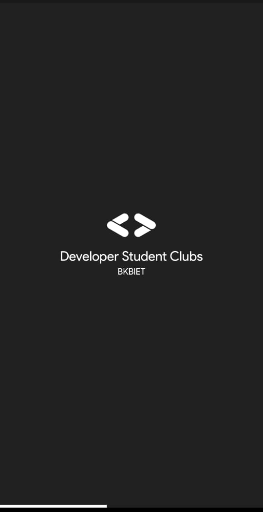

# DSC BKBIET

This Flutter application is created for events of DSC BKBIET.

## Features

* [x] Android
  * [x] Fetch Data from Firestore
  * [x] Beautiful UI
  * [x] Beautiful Animations
  * [x] Can view old events happened

### Screenshots

#### Splash Screen

#### Events Card Screen

#### Events Detials Screen

### Created & Maintained By
[Shekhar Aggarwal](https://github.com/shekharAggarwal)

# License

    Copyright 2020 DSC BKBIET

    Licensed under the Apache License, Version 2.0 (the "License");
    you may not use this file except in compliance with the License.
    You may obtain a copy of the License at

       http://www.apache.org/licenses/LICENSE-2.0

    Unless required by applicable law or agreed to in writing, software
    distributed under the License is distributed on an "AS IS" BASIS,
    WITHOUT WARRANTIES OR CONDITIONS OF ANY KIND, either express or implied.
    See the License for the specific language governing permissions and
    limitations under the License.

## Getting Started

For help getting started with Flutter, view our online
[documentation](http://flutter.io/).

For help on editing plugin code, view the [documentation](https://flutter.io/platform-plugins/#edit-code).